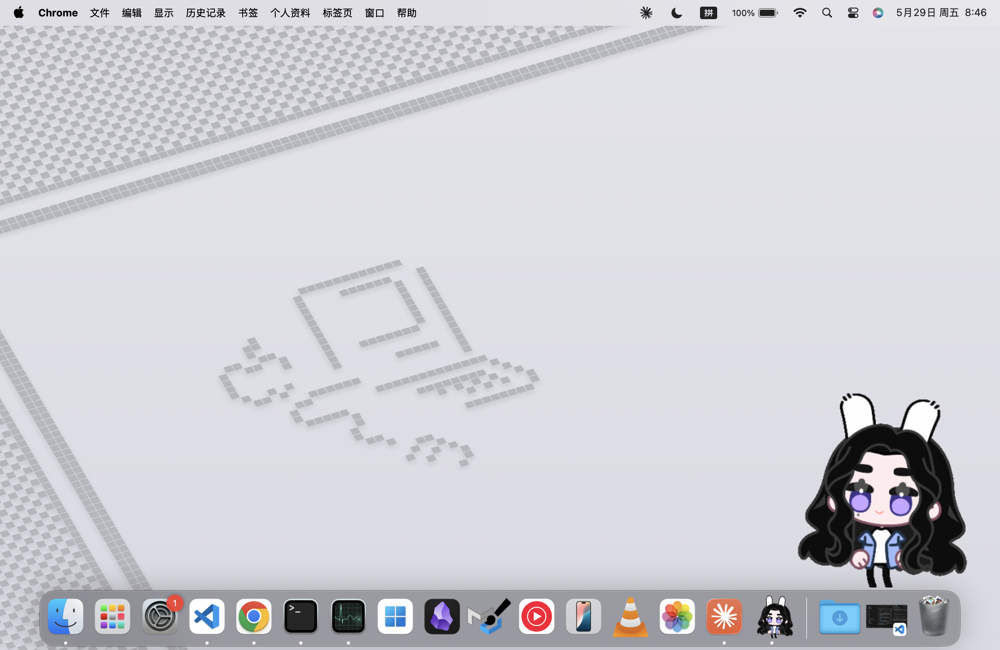
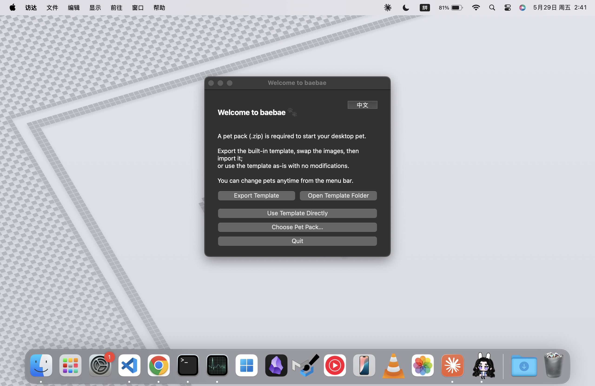
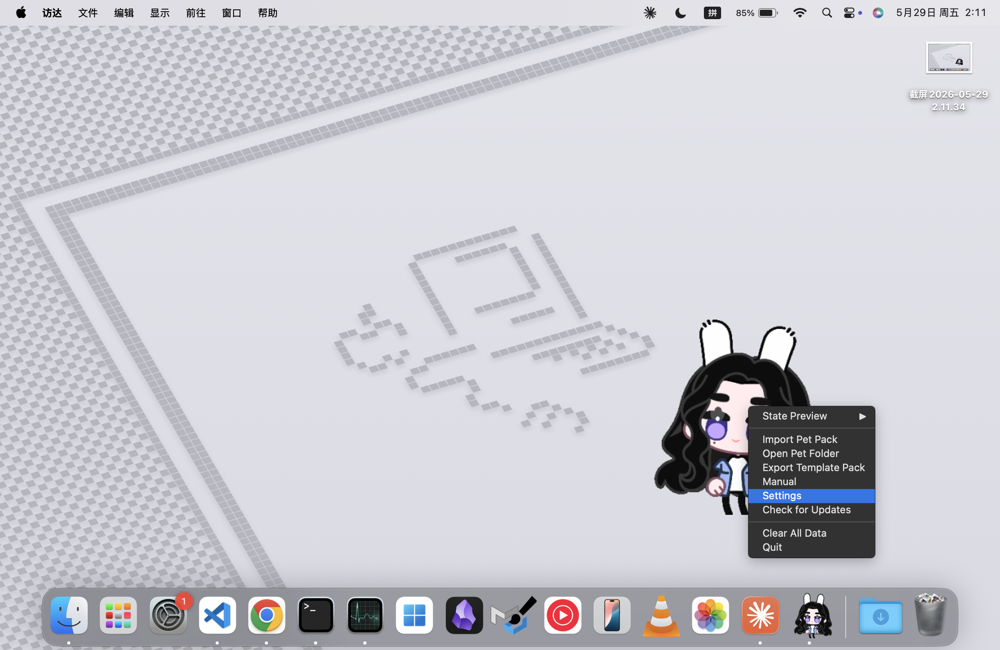
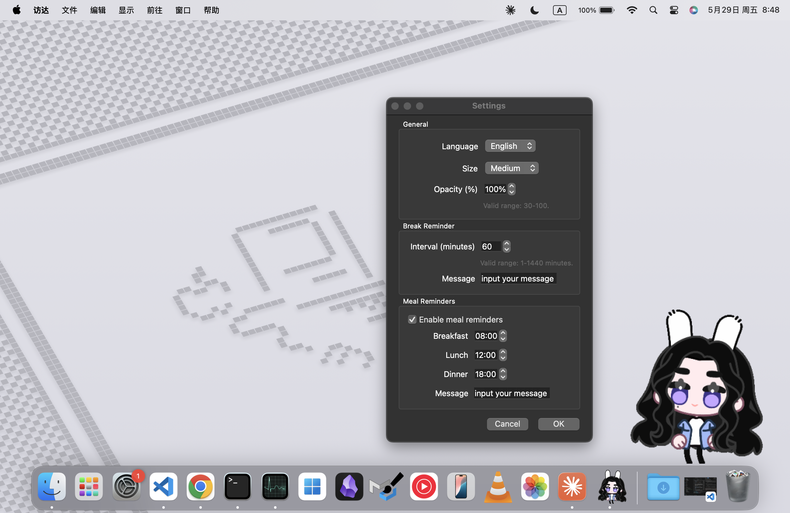
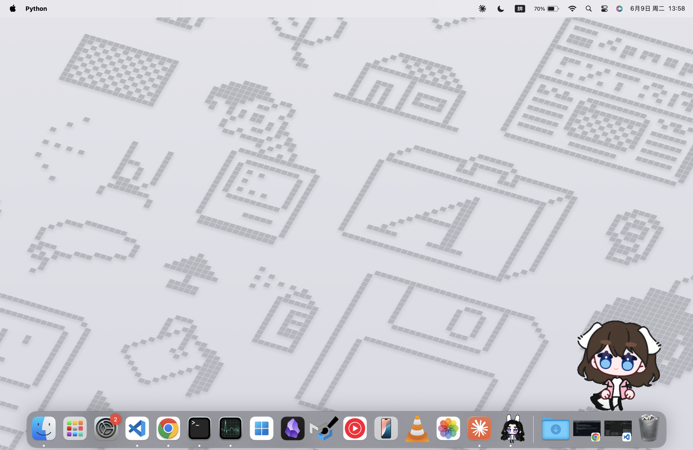

# Baebae Pet

[中文](#中文) | [English](#english)

## 中文

Baebae Pet 是一个轻量级跨平台桌面宠物框架，支持 macOS 和 Windows。它专注于低打扰陪伴、状态动画、键盘活动感知、休息提醒和可替换素材包。

🎉 **最新版本：v1.2.0** · [📦 立即下载](https://github.com/todayisark/baebae-pet/releases/latest) ⬅️



### 功能

- 透明、无边框、可拖拽的桌面宠物窗口
- macOS 原生置顶处理，支持跨 Space 和全屏辅助窗口；Windows 同样支持置顶
- 键盘输入感知、点击回应、拖拽状态、右键菜单
- 可导入 `.zip` 素材包，支持多个皮肤一键切换
- 支持中文 / English 切换
- 首次启动引导界面，支持导入素材包、直接使用模板或导出模板后自定义
- 修改设置界面，调整语言、大小、透明度、休息提醒和吃饭提醒

### 安装和运行

#### 直接下载（推荐）

前往 [Releases](https://github.com/todayisark/baebae-pet/releases/latest) 下载最新版本：

- **macOS (Apple Silicon)**：下载 `baebae-pet-v1.2.0-macos-arm64.zip`，解压后将 `Baebae Pet.app` 拖入「应用程序」文件夹；首次打开需在「**系统设置 → 隐私与安全性**」中点击「仍要打开」，并在「辅助功能」中允许该 App
- **Windows**：下载 `baebae-v1.2.0-windows-x64.zip`，解压后直接运行 `.exe`；若弹出 SmartScreen 提示，点击「更多信息 → 仍要运行」

#### 从源码运行

要求：

- macOS 或 Windows
- Python 3.11+
- 辅助功能权限（macOS）或后台输入监听权限（Windows），用于监听键盘和鼠标活动

从源码运行：

```bash
python3 -m venv .venv
. .venv/bin/activate
python -m pip install --upgrade pip
python -m pip install -r requirements.txt
python main.py
```

如果输入监听没有生效：

- **macOS**：前往「系统设置 → 隐私与安全性 → 辅助功能」，将终端 App 或打包后的 App 加进去，然后重新启动程序
- **Windows**：以普通用户身份运行通常即可；如仍无法监听输入，尝试以管理员身份运行

### 使用

**首次启动**时会显示引导窗口，可以：

- 导出模板到 `~/Downloads/pet_template.zip`，解压后替换图片再导入
- 打开模板所在目录
- 直接使用内置模板启动（无需导入）
- 导入已有的 `.zip` 素材包
- 切换界面语言（中文 / English）



启动后宠物出现在桌面上。**右键宠物**可以打开菜单：

- 预览不同状态动画
- **切换宠物**（在已导入的素材包之间一键切换）
- 导入素材包
- 打开当前宠物的素材目录
- 导出模板素材包
- 打开使用手册
- 打开设置窗口，调整语言、大小、透明度、休息提醒和吃饭提醒
- 清除所有数据
- 退出程序





### 皮肤

#### little-wan



little-wan 是官方发布的第一款公开皮肤。

> 下载：前往 [Releases](https://github.com/todayisark/baebae-pet/releases/latest) 页面下载 `little-wan.zip`，通过右键菜单「导入素材包」导入即可。

### 素材包

素材包是一个包含 `manifest.json` 和状态目录的文件夹，可以压缩成 `.zip` 后通过右键菜单导入。

如果想基于示例素材制作自己的宠物，可以在引导界面或右键菜单选择"导出模板"。程序会把模板导出到 `~/Downloads/pet_template.zip`。先解压这个 zip，替换各状态目录中的 PNG，修改 `manifest.json` 里的 `name`、`author` 和 `version`，再把素材包文件夹重新压缩为 zip 后导入。

示例结构：

```text
my_pet/
├── manifest.json
├── idle/
│   ├── 0.png         ← 默认待机帧
│   ├── 1.png
│   ├── ...
│   ├── stretch/      ← 随机子动作（可选）
│   │   ├── 0.png
│   │   └── ...
│   └── yawn/         ← 随机子动作（可选）
│       ├── 0.png
│       └── ...
├── typing/
├── typing_flow/
├── sleep/
├── meal/
├── hello/
├── remind/
├── poke/
│   ├── 0.png         ← 默认 poke（点击任意位置回退用）
│   ├── ...
│   ├── up/           ← 点击上段触发（可选）
│   ├── mid/          ← 点击中段触发（可选）
│   └── down/         ← 点击下段触发（可选）
├── drag/
├── drag_3s/          ← 拖拽满 3 秒后切换（可选）
└── drag_5s/          ← 拖拽满 5 秒后切换（可选）
```

**所有状态文件夹均为可选**。程序会自动检测哪些文件夹存在且有 PNG 帧，不存在则跳过该状态，无需修改 `manifest.json`。

`manifest.json` 示例：

```json
{
  "name": "my_pet",
  "author": "your_name",
  "version": "0.1",
  "frameSize": [200, 200],
  "animations": {
    "idle": { "fps": 8 },
    "idle/stretch": { "fps": 10 },
    "idle/yawn": { "fps": 6 },
    "typing": { "fps": 8 },
    "typing_flow": { "fps": 8 },
    "sleep": { "fps": 8 },
    "meal": { "fps": 8 },
    "hello": { "fps": 8 },
    "remind": { "fps": 8 },
    "poke": { "fps": 8 },
    "poke/up": { "fps": 8 },
    "poke/mid": { "fps": 8 },
    "poke/down": { "fps": 8 },
    "drag": { "fps": 8 },
    "drag_3s": { "fps": 8 },
    "drag_5s": { "fps": 8 }
  }
}
```

子动作和 poke 分区的 FPS 可以在 `manifest.json` 中单独指定，未指定则默认 8 FPS。帧文件按数字顺序加载，建议使用透明背景 PNG。

### 开发

运行测试：

```bash
.venv/bin/python -m unittest discover -s tests
```

快速语法检查：

```bash
.venv/bin/python -m py_compile main.py engine/*.py ui/*.py config/*.py tests/*.py
```

### 项目结构

```text
baebae-pet/
├── main.py                    # 程序入口和状态协调
├── engine/
│   ├── activity_monitor.py    # 键盘/鼠标活动监听
│   ├── animator.py            # 素材加载和动画播放数据
│   ├── i18n.py                # 中英文文本
│   ├── macos_window.py        # macOS 原生窗口置顶处理
│   ├── pet_template.py        # 模板素材包导出
│   ├── reminder.py            # 休息提醒气泡
│   ├── state_machine.py       # 宠物状态机
│   ├── update_checker.py      # 自动更新检测
│   └── window.py              # 宠物窗口和交互菜单
├── config/
│   └── settings.py            # 用户配置和素材目录管理
├── ui/
│   └── onboarding.py          # 首次启动引导界面
├── pets/
│   └── default_pet/           # 内置模板素材包
└── tests/                     # 行为测试
```

### 用户数据

运行时配置和导入的素材包存储在：

```text
~/Library/Application Support/baebae/
```

右键菜单中的"清除所有数据"会删除这个目录并退出程序。

### 鸣谢

本项目角色精灵图素材使用 EmoteLab 制作。

感谢 EmoteLab 作者：
https://github.com/0x4682b4

### License

Apache License 2.0. See [LICENSE](LICENSE).

---

## English

Baebae Pet is a lightweight cross-platform desktop pet framework for macOS and Windows. It focuses on quiet companionship, state-based animation, keyboard activity detection, break reminders, and replaceable pet asset packs.

🎉 **Latest release: v1.2.0** · [📦 Download now](https://github.com/todayisark/baebae-pet/releases/latest) ⬅️


### Features

- Transparent, frameless, draggable desktop pet window
- Native macOS always-on-top handling with Spaces and fullscreen support; always-on-top also supported on Windows
- Keyboard activity detection, click reaction, drag state, and context menu
- Import `.zip` pet packs and switch between multiple skins in one click
- Chinese / English language switch
- First-run onboarding with options to import a pack, use the bundled template directly, or export the template for customization
- Settings window to adjust language, size, opacity, break reminders, and meal reminders

### Install And Run

#### Download (recommended)

Go to [Releases](https://github.com/todayisark/baebae-pet/releases/latest) and download the latest build:

- **macOS (Apple Silicon)**: download `baebae-pet-v1.2.0-macos-arm64.zip`, unzip it, and drag `Baebae Pet.app` to your Applications folder; on first launch go to **System Settings → Privacy & Security** to allow the app and enable it under **Accessibility**
- **Windows**: download `baebae-v1.2.0-windows-x64.zip`, unzip it, and run the `.exe` directly; if Windows SmartScreen appears, click **More info → Run anyway**

#### Run from source

Requirements:

- macOS or Windows
- Python 3.11+
- Accessibility permission (macOS) or background input monitoring (Windows) for keyboard and mouse activity

Run from source:

```bash
python3 -m venv .venv
. .venv/bin/activate
python -m pip install --upgrade pip
python -m pip install -r requirements.txt
python main.py
```

If input monitoring does not work:

- **macOS**: go to **System Settings → Privacy & Security → Accessibility**, add your terminal app or the packaged app, then restart Baebae Pet
- **Windows**: running as a normal user usually works; if input is still not detected, try running as Administrator

### Usage

**On first launch**, an onboarding window appears with options to:

- Export the template to `~/Downloads/pet_template.zip`, customize it, then import
- Open the template folder directly
- Use the bundled template as-is (no import needed)
- Import an existing `.zip` pet pack
- Toggle the interface language (Chinese / English)


After launch, the pet appears on the desktop. **Right-click the pet** to open the menu:

- Preview animation states
- **Switch Pet** (switch between installed packs in one click)
- Import a pet pack
- Open the current pet folder
- Export a template pet pack
- Open the manual
- Open settings to adjust language, size, opacity, break reminders, and meal reminders
- Clear all data
- Quit


### Skins

#### little-wan


little-wan is the first officially released public skin.

> Download: grab `little-wan.zip` from the [Releases](https://github.com/todayisark/baebae-pet/releases/latest) page and import it via the right-click menu.

### Pet Packs

A pet pack is a folder containing `manifest.json` and one folder per animation state. It can be zipped and imported from the context menu.

To create your own pet from the sample frames, choose "Export Template" from the onboarding window or the context menu. Baebae Pet exports the template to `~/Downloads/pet_template.zip`. Unzip it, replace the PNG frames, edit `name`, `author`, and `version` in `manifest.json`, then zip the pet folder again and import it.

Example structure:

```text
my_pet/
├── manifest.json
├── idle/
│   ├── 0.png         ← default idle frames
│   ├── 1.png
│   ├── ...
│   ├── stretch/      ← random sub-action (optional)
│   │   ├── 0.png
│   │   └── ...
│   └── yawn/         ← random sub-action (optional)
│       ├── 0.png
│       └── ...
├── typing/
├── typing_flow/
├── sleep/
├── meal/
├── hello/
├── remind/
├── poke/
│   ├── 0.png         ← default poke fallback
│   ├── ...
│   ├── up/           ← top-zone click (optional)
│   ├── mid/          ← mid-zone click (optional)
│   └── down/         ← bottom-zone click (optional)
├── drag/
├── drag_3s/          ← triggered after 3 s of dragging (optional)
└── drag_5s/          ← triggered after 5 s of dragging (optional)
```

**All state folders are optional.** The app automatically detects which folders exist and contain PNG frames; missing folders are silently skipped without any `manifest.json` changes required.

Example `manifest.json`:

```json
{
  "name": "my_pet",
  "author": "your_name",
  "version": "0.1",
  "frameSize": [200, 200],
  "animations": {
    "idle": { "fps": 8 },
    "idle/stretch": { "fps": 10 },
    "idle/yawn": { "fps": 6 },
    "typing": { "fps": 8 },
    "typing_flow": { "fps": 8 },
    "sleep": { "fps": 8 },
    "meal": { "fps": 8 },
    "hello": { "fps": 8 },
    "remind": { "fps": 8 },
    "poke": { "fps": 8 },
    "poke/up": { "fps": 8 },
    "poke/mid": { "fps": 8 },
    "poke/down": { "fps": 8 },
    "drag": { "fps": 8 },
    "drag_3s": { "fps": 8 },
    "drag_5s": { "fps": 8 }
  }
}
```

FPS for sub-actions and poke zones can be set individually in `manifest.json`; defaults to 8 FPS if omitted. Frames are loaded in numeric order. Transparent PNG files are recommended.

### Development

Run tests:

```bash
.venv/bin/python -m unittest discover -s tests
```

Quick syntax check:

```bash
.venv/bin/python -m py_compile main.py engine/*.py ui/*.py config/*.py tests/*.py
```

### Project Structure

```text
baebae-pet/
├── main.py                    # App entry point and state coordinator
├── engine/
│   ├── activity_monitor.py    # Keyboard and mouse activity monitor
│   ├── animator.py            # Asset loading and animation data
│   ├── i18n.py                # Chinese and English UI text
│   ├── macos_window.py        # Native macOS window level handling
│   ├── pet_template.py        # Template pet pack export
│   ├── reminder.py            # Break reminder bubble
│   ├── state_machine.py       # Pet state machine
│   ├── update_checker.py      # Auto update checker
│   └── window.py              # Pet window and context menu
├── config/
│   └── settings.py            # User settings and pet directory management
├── ui/
│   └── onboarding.py          # First-run onboarding UI
├── pets/
│   └── default_pet/           # Bundled template pet pack
└── tests/                     # Behavior tests
```

### User Data

Runtime settings and imported pet packs are stored at:

```text
~/Library/Application Support/baebae/
```

"Clear All Data" in the context menu deletes this directory and quits the app.

### Acknowledgements

Sprite assets used in this project were created with EmoteLab.

Thanks to the creator of EmoteLab:
https://github.com/0x4682b4

### License

Apache License 2.0. See [LICENSE](LICENSE).
